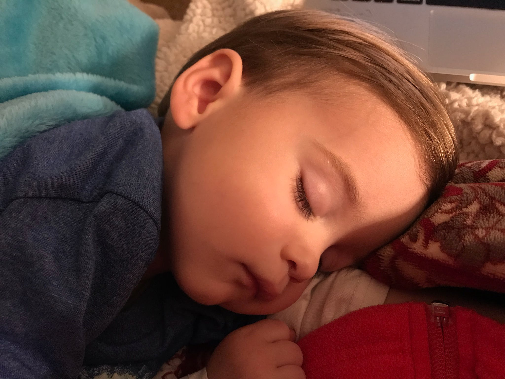

# Lithophane

Creating a lithophane directly in Cura by opening an image and orentating it along the y-axis to reduce jaring and the chance it detaches from the bed.

## Image 

Picture of Ryan sleeping

 2014 x 1536 pixels / 72 ppi

## Attempt 1

Loaded color(did not convert to BW as recommended) image.

	Height		2.5 mm
	Base 		0.4 mm
	Width 		120 mm
	Depth 		90 mm
				Darker is Higher
	Smoothing 	Just a little bit
 
ryan-sleeping.gcode - Dan's PG PLA 0.2mm / 99& infill / 4h 26m

Manual tune flow to 120% because brim failed(traces separated) on first attempt. Also there was some bleed from the previous red filament.

## Attempt 2

Never actually used "Super Quality" yet; Let's see what that looks like...

Same image settings...

ryan-sleeping-super-quality.gcode - Super Quality 0.12mm / 99% infill / 8h 2m

