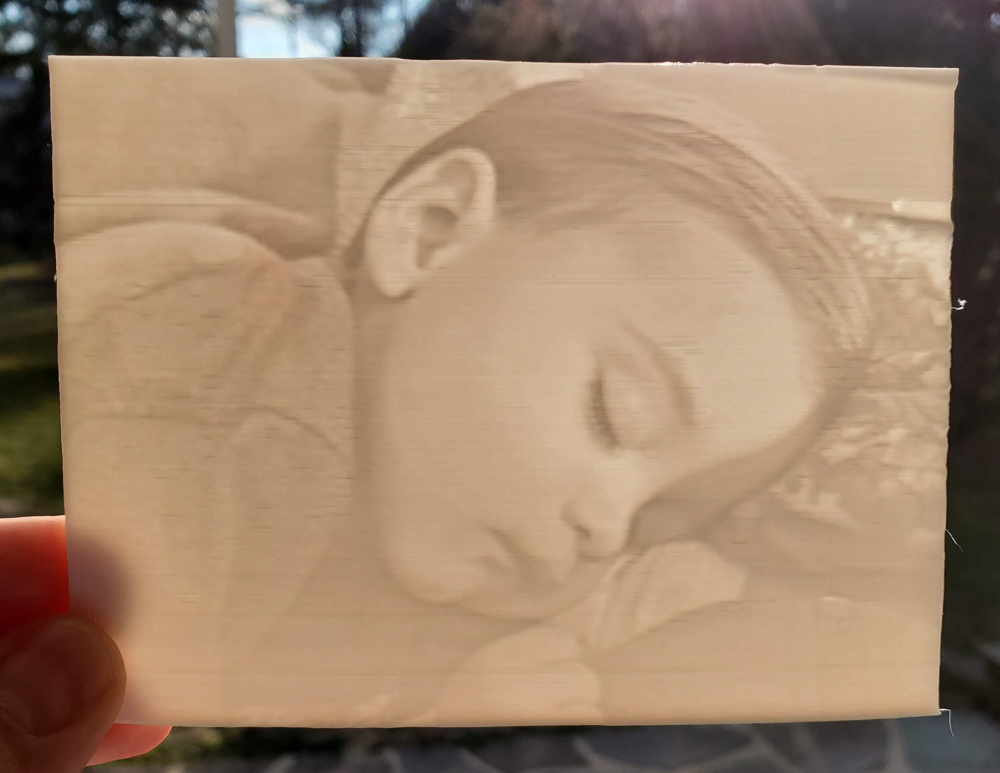
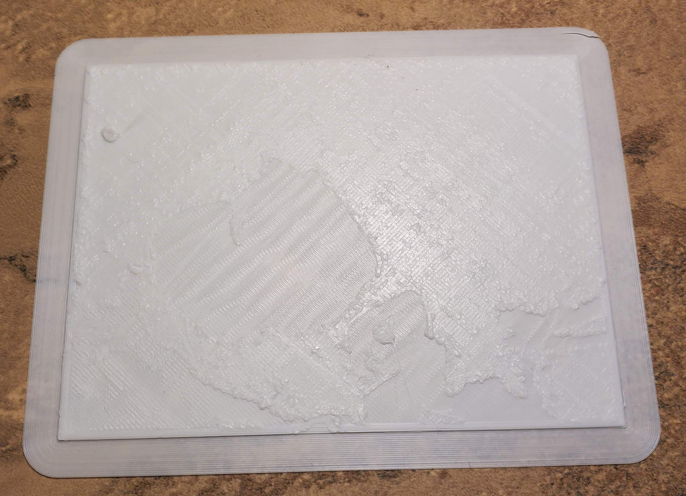
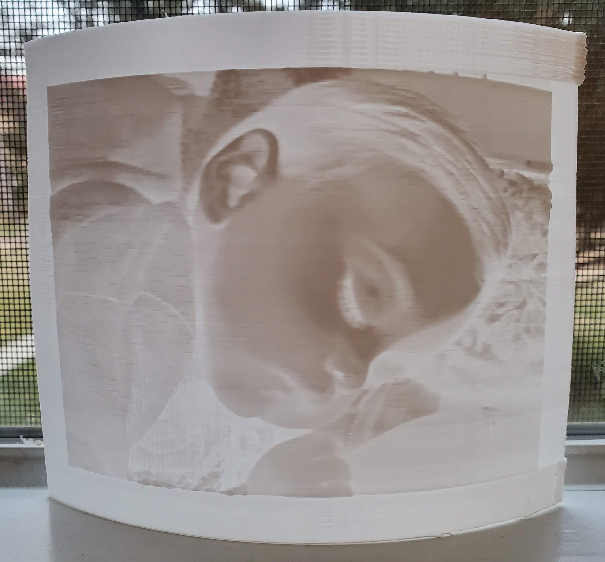

# Lithophane

Creating a lithophane directly in Cura by opening an image and orentating it along the y-axis to reduce jaring and the chance it detaches from the bed.

## Image 

Picture of Ryan sleeping

 2014 x 1536 pixels / 72 ppi

## Attempt 1

Loaded color(did not convert to BW as recommended) image.

	Height		2.5 mm
	Base 		0.4 mm
	Width 		120 mm
	Depth 		90 mm
				Darker is Higher
	Smoothing 	Just a little bit
 
ryan-sleeping.gcode - Dan's PG PLA 0.2mm / 55°C bed /  200°C nozzle /  99% infill / 4h 26m

*Manual tune flow to 120% because brim failed(traces separated) on first attempt. Also there was some bleed from the previous red filament.*

### Attempt 1a

Same but printed flat on the bed.

ryan-sleeping-flat.gcode - Dan's PG PLA 0.2mm / 55°C bed /  200°C nozzle /  99% infill / 3h 54m / 30g

*Will there be less resolution this way?*

FAILED: Surface was finishing rough and the head was crashing. I didn't think this would come out good because the resolution in the x/y is the nozzle width(0.4mm) as opposed to the resolution in the z where it's the layer height(0.2mm) but, I did not expect it to fail. Looks like it is time to re-level.

## Attempt 2

Never actually used "Super Quality" yet; Let's see what that looks like...

Same image settings...

ryan-sleeping-super-quality.gcode - Super Quality 0.12mm / 55°C bed /  200°C nozzle / 99% infill / 8h 2m / 29g

*Again manually tuned flow to 120%*

## Attempt 3

Using [Image to Lithophane](http://3dp.rocks/lithophane/) this time...

### Model Settings

	Maximum Size (MM)		127
	Thickness (MM)			1.2
	Border (MM)				10
	Thinnest Layer (MM)		0.5*
	Vectors Per Pixel		4
	Base/Stand Depth		0
	Curve					90
	
**All defaults but thinnest Layer which I had to change from 0.4 to 0.5 to fix skipped/void layers? Maybe I could have selected print thin walls in Cura but 0.4 should have been fine as that is the nozzle width.*

*Printed with wrong profile which was z hopping which resulted in the familiar zitting. Temperatures were also low which resulted in poor bed adhesion.*

#### Files	

	ryan-sleeping.jpeg.stl
	ryan-sleeping.jpeg.gcode 195°C nozzle / 55°C bed / 99% infill 2h 5m / 13g

## Attempt 4

Using [Image to Lithophane](http://3dp.rocks/lithophane/) again.

### Model Settings

	Maximum Size (MM)		127
	Thickness (MM)			2.4 (0.4*6)
	Border (MM)				10
	Thinnest Layer (MM)		0.5*
	Vectors Per Pixel		4
	Base/Stand Depth		0
	Curve					90
	
#### Files

	ryan-sleeping.jpeg.curved.stl
	ryan-sleeping.jpeg.curved.gcode 200°C nozzel / 55°C bed / 99% infill 2h 47m / 17g
	
The image was negative. Next time remember to switch it to positive.

	

	
