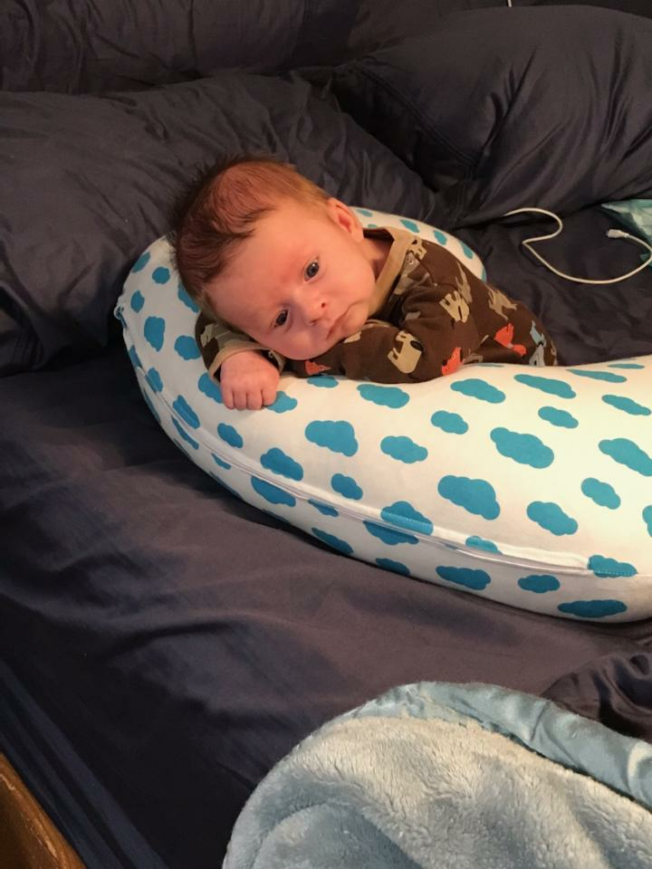
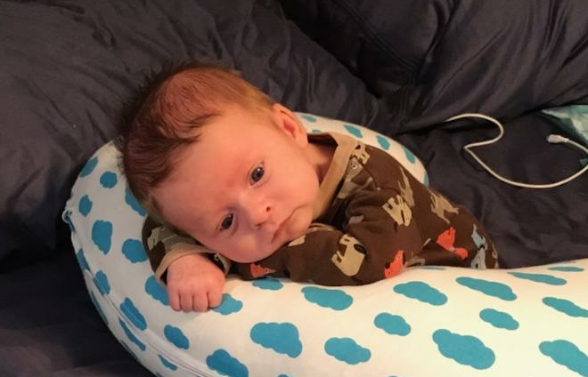
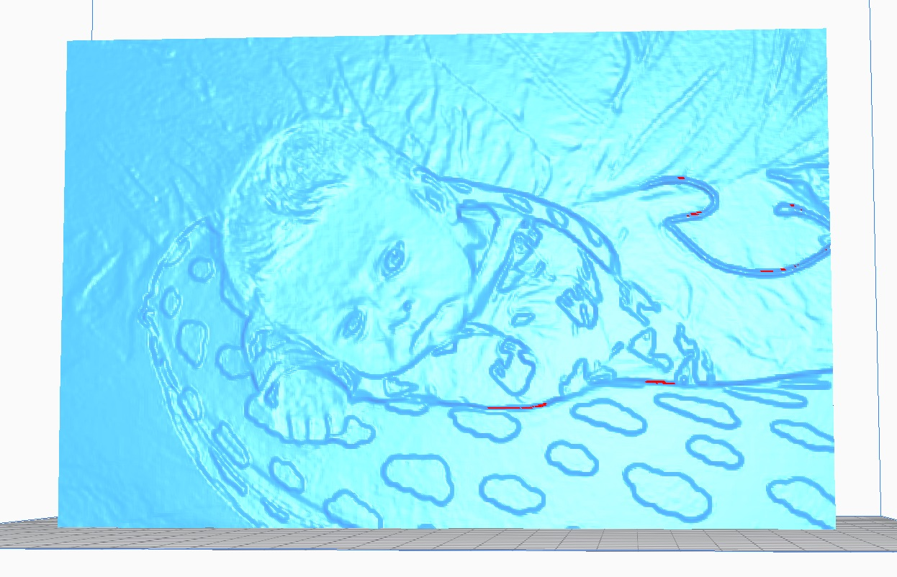
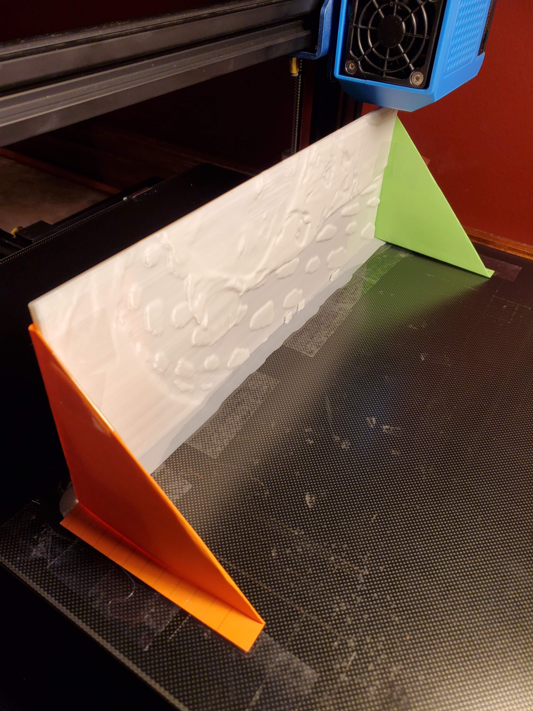
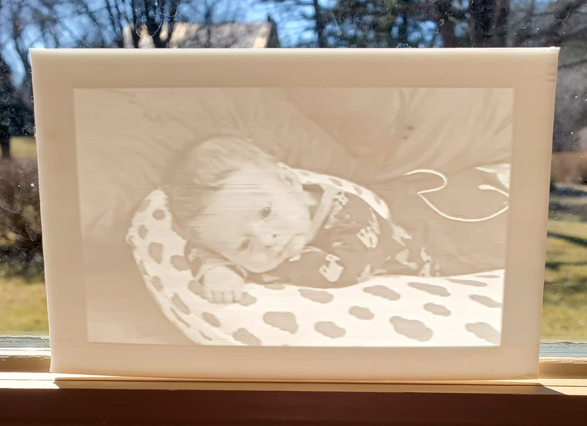

# Thorston

2/22/2020

**Raw Image**

**Cropped**

## Attempt 1

**Cura Import**

	Width 240mm
	
### Print Settings	

	Dan's PG PLA 0.2mm
	
	Bed 	55°C
	Nozzle	200°C
	Infill	99%
	Regular Fan Speed at Layer 16
	

thor.gcode - 13h 53m / 95g

### FAILED

Too aggressive; the print was too tall and began to wobble so I abandoned it. Attempted to support with side angles but, the face also had layer defects in it which made the subject look pretty bad. The bed adhesion was also pretty bad and it lifted completely on both ends. Will try regular fan speed at layer 2 on the next print.

## Attempt 2

Using [Image to Lithophane](http://3dp.rocks/lithophane/). This option is nice because you get a boarder.

### Model Settings

	Maximum Size (MM)		127
	Thickness (MM)			2.8
	Border (MM)				10
	Thinnest Layer (MM)		0.5*
	Vectors Per Pixel		4
	Base/Stand Depth		0
	Curve					90
	
### Image Settings
	
	Positive Image

### Print Settings	

	Dan's PG PLA 0.2mm
	
	127 x 2.8 x 81.6 mm
	
	Bed 				55°C
	Nozzle				200°C
	Infill				99%
	Print Thin Wall	On*
	Regular Fan Speed at Layer 2

### Files
	
1. thor.3dp.rocks.stl
1. thor.3dp.rocks.gcode - 4h 22m / 30g

### Outcome

